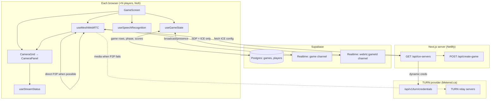
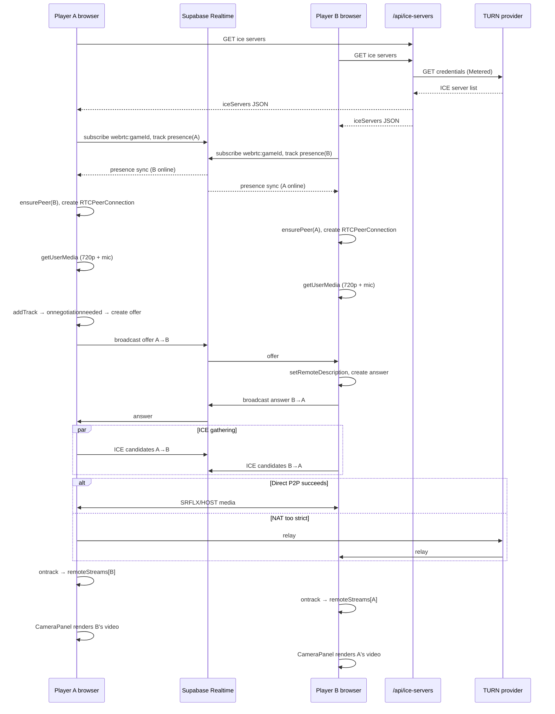

# WhoSmarter Video System — Full Technical Specification

This document describes how video (and related audio) works in the **WhoSmarter** quiz app today. It is written for handoff to another AI or engineer deciding infrastructure, scaling, and iOS parity.

---

## 1. Product context

WhoSmarter is a **multiplayer quiz** (up to **6 players**) where everyone runs the same web client. During a game:

- Each player sees a **full-screen grid of live camera feeds** (WhatsApp-style video call behind the quiz UI).
- The host can enable or disable cameras at game creation (`cameras_enabled`). When off, players still capture **mic-only** streams.
- **Game state** (questions, phases, scores) syncs via **Supabase Realtime + Postgres**.
- **Video/audio** does **not** go through your server. It is **peer-to-peer WebRTC** with optional **TURN relay** when direct P2P fails.

There is **no SFU, no media server, no recording pipeline in production** (optional local clip recording exists but is secondary).

---

## 2. High-level architecture



**Key separation:**

| Concern | Transport | Data |
|--------|-----------|------|
| Quiz logic | Supabase DB + Realtime | phases, answers, scores |
| WebRTC signaling | Supabase Realtime Broadcast | SDP offers/answers, ICE candidates |
| Actual A/V media | WebRTC (UDP/TCP, optionally via TURN) | encoded video/audio |

---

## 3. Component map

| Layer | File | Role |
|-------|------|------|
| Orchestration | `components/GameScreen.tsx` | Wires game state, WebRTC, speech, mic policy, feed lifecycle |
| WebRTC mesh | `hooks/useMeshWebRTC.ts` | Full mesh, signaling, ICE, capture, quality scaling |
| ICE credentials | `app/api/ice-servers/route.ts` | Server-side TURN secret fetch (not in JS bundle) |
| UI grid | `components/CameraGrid.tsx` | Layout of all player tiles |
| UI tile | `components/CameraPanel.tsx` | `<video>` + diagnostics per player |
| Stream health | `hooks/useStreamStatus.ts` | Mic level, video live/dead detection |
| Types | `lib/types.ts` | `WebRTCSignal`, `Game.cameras_enabled` |
| iOS plan | `ios_implementation_help.md` | Port guide for `react-native-webrtc` |

---

## 4. Lifecycle: when video starts and stops

### 4.1 Game creation

Host toggles **Cameras on/off** in `CreateGame.tsx`. That becomes `cameras_enabled` on the `games` row via `POST /api/create-game`.

```typescript
// lib/types.ts
cameras_enabled: boolean;  // default false = mic-only mesh
```

### 4.2 Lobby → playing

1. Player joins → gets a seat (`players.id` UUID = WebRTC identity).
2. `GameScreen` calls `startCamera()` as soon as `me` exists (even in lobby).
3. `useMeshWebRTC` joins signaling **immediately** (does not wait for camera permission).
4. When host starts, game status → `playing`; camera mesh is already forming.

### 4.3 During game

- `CameraGrid` fills the background; `QuestionPanel` floats on top.
- Mic policy (see §8) changes by phase and game mode.
- On `phase === 'ended'`, a **60-second discussion window** keeps feeds live, then `stopCamera()` tears down all media.

### 4.4 Rematch

If feeds were cut and a rematch starts, `startCamera()` runs again.

---

## 5. WebRTC topology: full mesh

### 5.1 Model

For **N players**, each browser maintains **N−1** `RTCPeerConnection` objects — one per other player.

Connections per game: **N × (N−1) / 2** (undirected pairs).

| Players | Peer connections per client | Total pairs |
|---------|----------------------------|-------------|
| 2 | 1 | 1 |
| 3 | 2 | 3 |
| 4 | 3 | 6 |
| 6 | 5 | 15 |

Each client **uploads its stream to every other client**. Upload bandwidth scales **O(N)** per client; total relay bandwidth scales **O(N²)** if everyone needs TURN.

### 5.2 What each connection carries

When `cameras_enabled === true`:

- **1 video track** (720p down to 480p depending on peer count)
- **1 audio track** (always captured; enabled/disabled via `track.enabled`)

When `cameras_enabled === false`:

- **Audio only** (`getUserMedia({ video: false, audio: true })`)

Tracks are added with `pc.addTrack(track, stream)` — same `MediaStream` object shared across all peer connections.

### 5.3 Discovery vs capture (important design choice)

**Discovery is decoupled from capture:**

1. On mount, hook joins `webrtc:{gameId}` and tracks presence with key `myId`.
2. Presence `sync`/`join`/`leave` → open or tear down peer connections.
3. Camera may resolve later; when `localStream` arrives, tracks are attached to existing PCs and **renegotiation** fires via `onnegotiationneeded`.

This avoids the failure mode where one player waits on camera permission while the other never sees them in the channel.

---

## 6. Signaling (Supabase Realtime)

### 6.1 Channel

```typescript
supabase.channel(`webrtc:${gameId}`, {
  config: {
    broadcast: { self: false },  // don't echo own messages
    presence:  { key: myId },    // player UUID
  },
});
```

### 6.2 Message shape

```typescript
// lib/types.ts
interface WebRTCSignal {
  type: 'offer' | 'answer' | 'ice-candidate';
  from: string;   // sender players.id
  to:   string;   // recipient players.id
  payload: RTCSessionDescriptionInit | RTCIceCandidateInit;
}
```

Sent as:

```typescript
channel.send({ type: 'broadcast', event: 'signal', payload: signal });
```

Each client **filters**: process only if `signal.to === myId && signal.from !== myId`.

### 6.3 Presence

After `SUBSCRIBED`, client calls:

```typescript
channel.track({ id: myId, at: Date.now() });
```

`reconcile()` reads `channel.presenceState()`, opens PCs for new peers, tears down offline peers.

**Self-healing:** every 3 seconds, `reconcile()` runs again to recover from missed join events or reload races.

**Mobile recovery:** on `visibilitychange`, `online`, and `focus` → re-announce presence + `startCamera()` + reconcile (iOS backgrounding was a real failure mode).

### 6.4 Perfect Negotiation

For each pair `(myId, peerId)`:

- **Polite side** = lower UUID string (`myId < peerId`)
- On **offer collision** (both sides send offers): impolite side ignores; polite side rolls back
- **ICE restart** on failure/disconnect: only **impolite** side calls `pc.restartIce()`

### 6.5 ICE candidate buffering

Remote ICE candidates received **before** `setRemoteDescription` are queued in `pendingCandidates[]` and flushed after SDP is applied. Dropping early candidates caused one-way video in the past.

---

## 7. ICE, STUN, and TURN

### 7.1 Why TURN exists here

STUN alone fails on roughly **10–20%** of networks: symmetric NAT, VPN, corporate firewalls, and some ISPs (notably blocking P2P). Without TURN, those users get **black remote video** even when signaling succeeds.

### 7.2 How clients get ICE servers

On mesh setup, each client calls:

```typescript
fetch('/api/ice-servers', { cache: 'no-store' })
```

Server route priority:

1. **Metered** (if `METERED_DOMAIN` + `METERED_API_KEY` env vars set):
   ```
   GET https://{METERED_DOMAIN}/api/v1/turn/credentials?apiKey={METERED_API_KEY}
   ```
   Returns dynamic TURN URLs + username + credential. Google STUN prepended.

2. **Static TURN** (if `TURN_URLS`, `TURN_USERNAME`, `TURN_CREDENTIAL` set): ExpressTURN or similar.

3. **Fallback** (hardcoded in client + server):
   - `stun:stun.l.google.com:19302`
   - `turn:freeturn.net:3478` (public, unreliable)
   - `turns:freeturn.net:5349`

Credentials are **never** in the frontend bundle — only fetched at runtime via the API route.

### 7.3 ICE candidate types

| Type | Meaning |
|------|---------|
| `host` | Direct local interface |
| `srflx` | STUN-reflexive (NAT hole punch) |
| `prflx` | Peer reflexive |
| `relay` | **TURN relay** — media goes through provider |

Debug logging treats `relay` as confirmation TURN is reachable. Stats logging (when `WEBRTC_DEBUG=true`) reports selected pair types and whether `usingTurnRelay`.

### 7.4 Current Metered plan constraint (infrastructure)

App integration requires **Full API Access** + **Global TURN servers** (Metered trial plan).

The separate **Free 20GB** Metered tier has more quota but **lacks** API access and global servers — incompatible with the current dynamic-credentials integration.

**TURN bandwidth billing:** relay traffic counts against Metered quota. A mesh where multiple peers relay video can consume quota quickly.

---

## 8. Media capture and transmission

### 8.1 Camera start (`startCamera`)

```typescript
navigator.mediaDevices.getUserMedia({
  video: camerasEnabled ? {
    width:      { ideal: tier.width },
    height:     { ideal: tier.height },
    facingMode: 'user',
    frameRate:  { ideal: tier.frameRate },
  } : false,
  audio: true,
});
```

After capture, **all audio tracks start disabled** (`track.enabled = false`). Mic is opened selectively by `setMicEnabled`.

### 8.2 Adaptive quality tiers

Peer count drives resolution, FPS, and sender max bitrate:

| Active peers (others online) | Resolution | FPS | Max bitrate |
|------------------------------|------------|-----|-------------|
| ≤2 | 1280×720 | 30 | 1200 kbps |
| ≤3 | 960×540 | 24 | 900 kbps |
| ≥4 | 640×480 | 20 | 600 kbps |

Applied via:

- `videoTrack.applyConstraints(...)` on local capture
- `RTCRtpSender.setParameters({ encodings: [{ maxBitrate }] })` per peer connection

### 8.3 Codec preference

On each video transceiver, prefers **VP9**, then H.264, then others (`setCodecPreferences` — best-effort, not all browsers support it).

### 8.4 Mic policy (`GameScreen`)

Two separate audio paths exist:

| Path | Purpose | API |
|------|---------|-----|
| **WebRTC audio track** | Other players hear you | `setMicEnabled()` toggles `track.enabled` on mesh stream |
| **Speech recognition** | Transcribe your spoken answer | Browser `SpeechRecognition` (separate mic access) |

Policy:

- **Multiple-choice mode:** mic **always ON** to peers (`setMicEnabled(true)`).
- **Voice answer mode:** mic **ON by default** so players can talk; while **holding answer button**, mic is **MUTED to peers** (so others don't hear your answer) and speech recognition records locally.

Speech recognition does **not** share the WebRTC `MediaStream`; Chrome opens its own capture internally.

---

## 9. Rendering pipeline

### 9.1 State flow

```
useMeshWebRTC
  localStream        → CameraGrid → CameraPanel (mirrored, muted video)
  remoteStreams[id]  → CameraGrid → CameraPanel (per peer)
  connected[id]      → connection indicator dot
```

### 9.2 CameraPanel video element rules

Critical implementation detail for iOS/TURN flakiness:

- `<video>` is **always mounted** (never conditionally unmounted).
- `srcObject` swapped when `stream.id` changes.
- `play()` retried on `loadedmetadata`; `AbortError` and `NotAllowedError` swallowed.
- Local tile: `muted={true}` (prevent echo), `transform: scaleX(-1)` mirror.

If remote stream briefly drops during ICE restart, keeping the element avoids `"play() request was interrupted because the media was removed from the document"`.

### 9.3 CameraGrid layouts

Tap any feed cycles 3 modes:

| Mode | Stage (large) | PiP (corner) |
|------|---------------|--------------|
| 0 (default) | Other players | Self |
| 1 | Self | Others |
| 2 | Everyone equal grid | None |

### 9.4 Stream health UI (`useStreamStatus`)

Per tile, ~8 Hz polling:

- **hasAudio / audioEnabled / audioMuted**
- **audioLevel** via shared `AudioContext` + `AnalyserNode` (not connected to speakers)
- **speaking** if level > 0.06 threshold
- **hasVideo / videoLive** (`readyState === 'live' && !muted`)

Diagnostics distinguish:

- No inbound bytes → ICE/TURN path broken
- Bytes growing but black tile → decode/render issue

---

## 10. Bandwidth and scaling math (for infrastructure planning)

### 10.1 Rough per-client upload (cameras on)

Each client uploads to **(N−1)** peers at tier bitrate:

| N | Tier kbps | Approx upload per client |
|---|-----------|--------------------------|
| 2 | 1200 | ~1.2 Mbps |
| 3 | 900 | ~1.8 Mbps |
| 6 | 600 | ~3.0 Mbps |

Add audio (~50–100 kbps × peers). Home uplinks often become the bottleneck before CPU.

### 10.2 TURN relay multiplier

If both sides of a pair need relay, **both directions** may traverse TURN → provider bills **both legs**.

Worst case (6 players, all on relay, all cameras on): potentially **15 pairs × ~600 kbps × 2 directions** ≈ **18 Mbps** of relay traffic concurrently — far beyond a 500 MB/month trial in sustained use.

### 10.3 Design ceiling

Code comments and architecture assume **~6 players max**. Beyond that, an **SFU** (LiveKit, mediasoup, etc.) would be needed — not implemented.

---

## 11. Relationship to game state

WebRTC is **orthogonal** to quiz phases:

- Phases (`thinking`, `question`, `answering`, `result`, `ended`) come from `useGameState` via Supabase.
- Video mesh stays up across phases (except explicit `stopCamera` at end of discussion).
- UI overlays (`speaking` pulse, ✓/✗ badges) are driven by game phase + player row fields, not WebRTC events.

Player identity for video = **`players.id`** (UUID), not `client_id` or slot number.

---

## 12. Failure modes (observed and handled)

| Symptom | Likely cause | Current mitigation |
|---------|--------------|-------------------|
| Black remote video | No TURN / strict NAT | Configure Metered or static TURN; verify `relay` candidates |
| One-way video | Early ICE candidates dropped | Buffer until remoteDescription set |
| Peer missing after reload | Presence race | 3s reconcile loop + visibility recovery |
| Offer glare / stuck connecting | Simultaneous offers | Perfect Negotiation |
| Connection drop mid-game | Mobile network / background | ICE restart (impolite side); presence re-announce |
| Black tile but stats show bytes | Render/play issue | Stable `<video>` element, guarded play() |
| Camera works WiFi not cellular | Missing TURN on cellular NAT | TURN required on cellular |
| Mic "off" badge while talking | Push-to-talk design | Expected when `track.enabled === false` |

---

## 13. iOS / React Native port (planned, not shipped)

From `ios_implementation_help.md`:

| Web | React Native |
|-----|--------------|
| `getUserMedia` | `react-native-webrtc` |
| `<video srcObject>` | `<RTCView streamURL={stream.toURL()} />` |
| Same signaling channel `webrtc:{gameId}` | Unchanged |
| Same `WebRTCSignal` shape | Unchanged |
| Fetch `/api/ice-servers` with absolute API base URL | Required |

Must use **Expo dev client** (not Expo Go) for WebRTC.

Info.plist: camera, mic, speech recognition, background audio mode.

iOS-specific risks called out in code: presence flaps, ICE restart, video element churn (addressed on web; RN equivalent needed).

Separate doc `IOS_CAMERA_LAYOUTS_AGENT.md` defines expanded layout modes for iOS (2-player vs 3+ schemes).

---

## 14. Environment variables (video-related)

| Variable | Purpose |
|----------|---------|
| `METERED_DOMAIN` | e.g. `myapp.metered.live` |
| `METERED_API_KEY` | Dynamic TURN credential API |
| `TURN_URLS` | Comma-separated static TURN URLs |
| `TURN_USERNAME` | Static creds |
| `TURN_CREDENTIAL` | Static creds |

Supabase vars are for game sync, not media relay.

---

## 15. End-to-end sequence (two players, cameras on)



---

## 16. What another AI should advise on

Given this architecture, the main forward-looking decisions are:

1. **TURN provider strategy**
   - Stay on Metered trial (500 MB, full API) for dev only?
   - Upgrade to paid Metered (Growth/Business) for production global relay?
   - Switch to ExpressTURN static creds (1 TB free tier mentioned in code comments)?
   - Multi-provider fallback?

2. **Quota vs usage model**
   - Mesh + TURN scales poorly; estimate monthly GB for expected concurrent games.
   - When to cap cameras, reduce default resolution, or move to SFU?

3. **SFU migration threshold**
   - At what player count / session volume does full mesh cost exceed operating an SFU?

4. **iOS parity**
   - Port `useMeshWebRTC` verbatim vs adopt LiveKit SDK for both platforms?
   - Background/foreground behavior on iOS with TURN?

5. **Speech vs WebRTC audio**
   - On iOS, unify mic capture or keep separate paths?
   - Whisper server-side transcription vs on-device?

6. **Observability**
   - Production logging of ICE candidate types, TURN usage, connection success rate?

---

## 17. Source-of-truth file list

Read in this order for implementation details:

1. `hooks/useMeshWebRTC.ts` — entire WebRTC engine (~910 lines)
2. `app/api/ice-servers/route.ts` — TURN credential server
3. `components/GameScreen.tsx` — lifecycle + mic policy
4. `components/CameraGrid.tsx` + `components/CameraPanel.tsx` — rendering
5. `hooks/useStreamStatus.ts` — per-tile health
6. `lib/types.ts` — `WebRTCSignal`, `cameras_enabled`
7. `ios_implementation_help.md` § Phase E — mobile port contract

---

## 18. Summary

**Current design:** Supabase for signaling and game state, browser mesh for media, server API for TURN secrets, no centralized video infrastructure.

**Main production risk:** TURN quota and mesh bandwidth — not the quiz logic itself.
